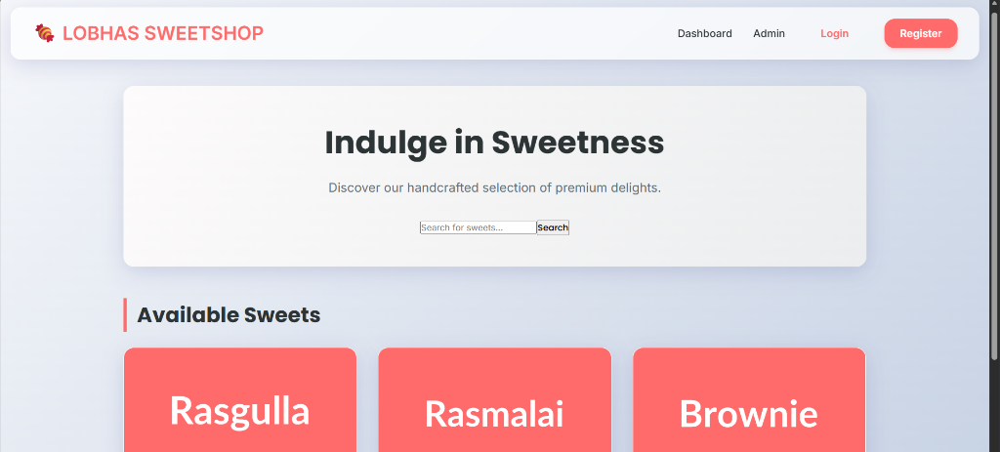
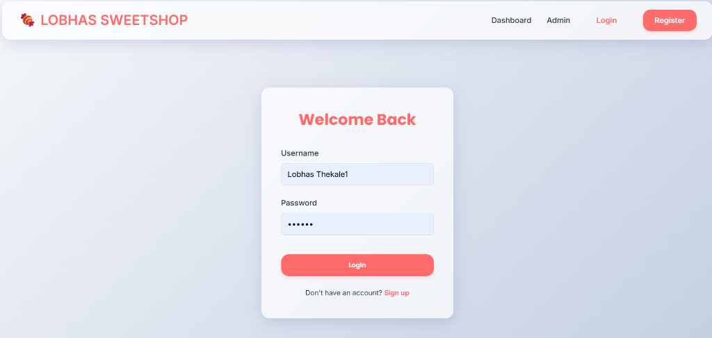
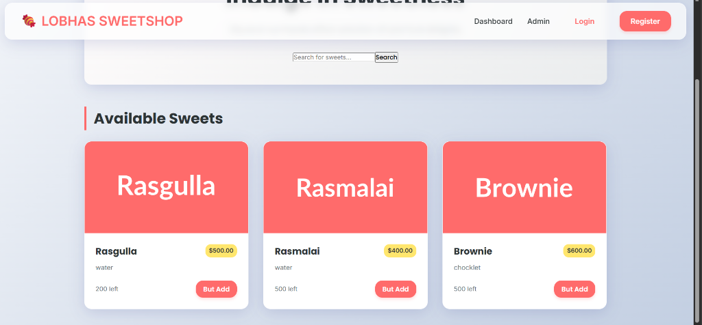
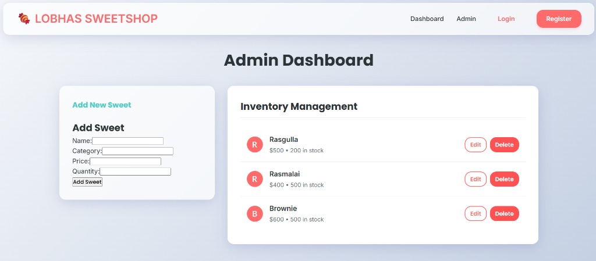

A modern, full-stack Sweet Shop Management System.

## Gallery
### Authentication
| | |
|:---:|:---:|
|  |  |

### Application



## Features
- **Premium UI**: Glassmorphism design with vibrant colors.
- **User Authentication**: Secure Login and Registration.
- **Dashboard**: Browse sweets with search functionality.
- **Admin Panel**: Manage inventory (Add/Edit/Delete sweets).
- **Responsive Design**: Works on all devices.

## Tech Stack
- **Frontend**: React, TypeScript, Modern CSS.
- **Backend**: Node.js, Express, MongoDB.

## Getting Started

### Prerequisites
- Node.js installed.
- MongoDB running locally or a cloud URI.

### Installation

1.  **Clone the repository:**
    ```bash
    git clone https://github.com/Lobhas-09/Lobhas-Sweet-shop.git
    cd Lobhas-Sweet-shop
    ```

2.  **Backend Setup:**
    ```bash
    cd backend
    npm install
    # Create .env file with MONGODB_URI and JWT_SECRET
    npm run dev
    ```

3.  **Frontend Setup:**
    ```bash
    cd frontend
    npm install
    npm start
    ```

## License
MIT
